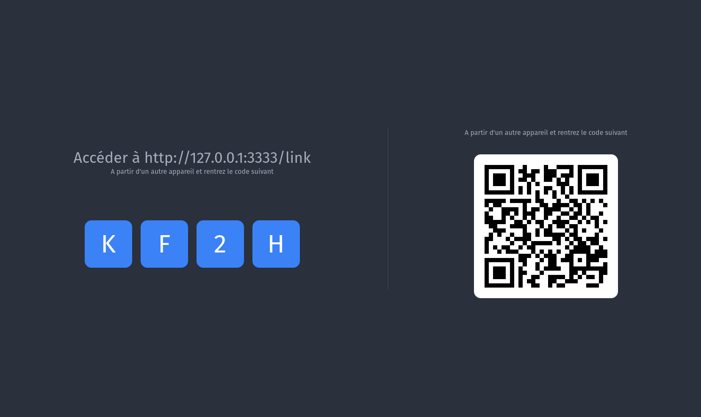
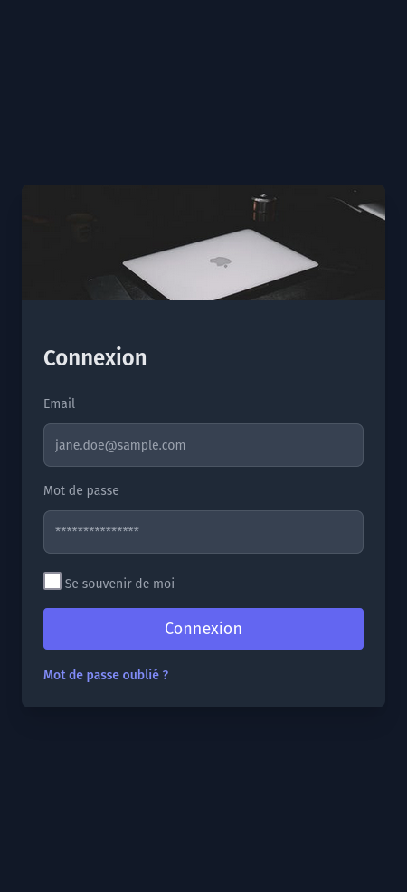
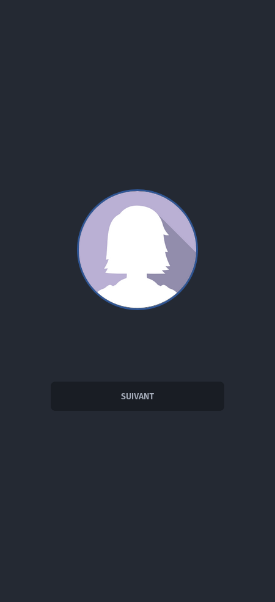
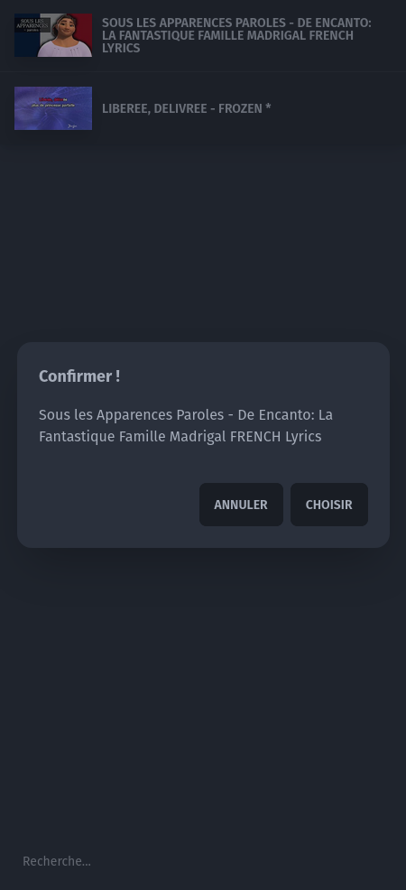

# App karaoke

Experimental karaoke app. Create a playlist by adding the youtube url of your choice and use your smartphone as a microphone.
[Adonis JS](https://adonisjs.com) framework, [inertia](https://inertiajs.com), [Svelte](https://svelte.dev), [Socket.io](https://socket.io) and [WebRTC](https://webrtc.org/)

# Installation

```bash
npm install (or yarn)
node ace generate:key
node ace migration:run
node ace db:seed
```

## Developing

```bash
npm run dev
visite http://localhost:3333/admin
```









